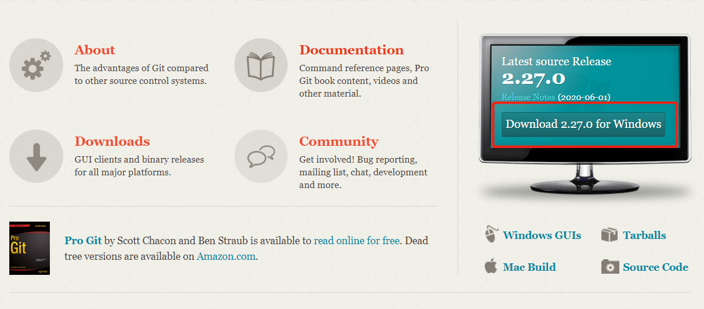
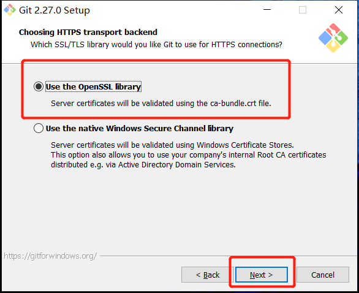

#### Git下载

访问`Git`官方 https://git-scm.com/ 下载最新版本的`Git`安装包，选择对应的格式，如下图：

#### Git安装

下载好后，双击安装包，打开进行安装

点击Next

选择安装的路径，全英文的安装路径，不要带有中文，选择好后点击Next

勾选想要安装的组件，这里我们选择默认就可以了，点击Next

选择程序启动文件夹，这里我们也是选择默认就行，点击Next

选择默认的编辑器，选择Vim作为默认编辑器

接下来是选择环境变量，使用的地方，我们只在Git Bash中使用Git命令，不在其它地方使用，如果在其它地方是用Git命令，有可能会出现冲突

接下来是选择使用SSL/TLS库，这里我们是用OpenSSL

接下来这个是行末换行的风格，就选默认就好了

接下来是默认的终端模式，使用MinTTY，MSYS2默认的终端来执行我们的命令行，如果使用Windows的cmd的话会与其他的环境起冲突

接下来这个等我搞清楚再写仔细点，先选默认就好

接下来也是默认

最后一个还有些bug，就暂时不勾选

点击Install，等待一会

安装成功，点击Next

然后在电脑上随便一个地方，右键，就可以看到如下`Git GUI Here`和`Git Bash Here`两个功能

我们在桌面有键，点击`Git Bash Here`，就可以看到如下界面，@符号前面的是我电脑登录的账户名，@符号后面的是我计算机名，至此Git安装就算是完成了

