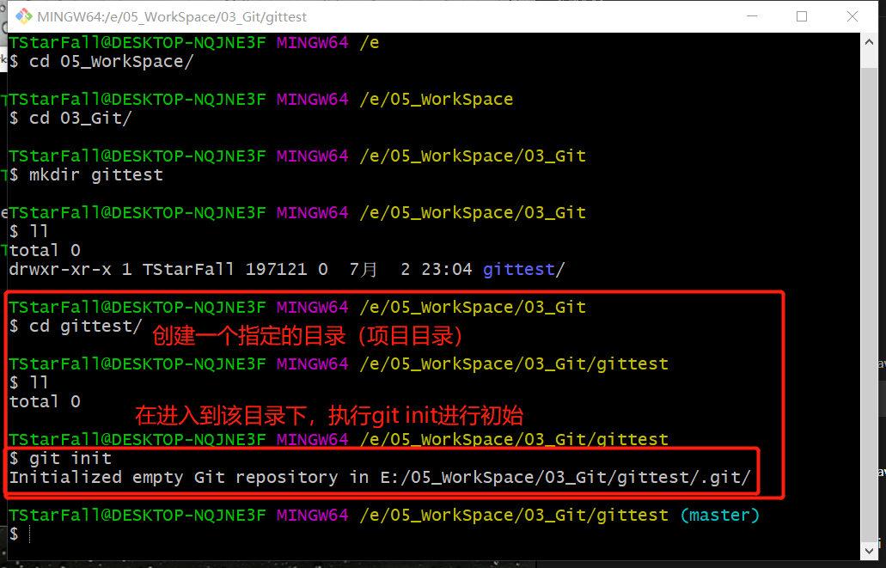
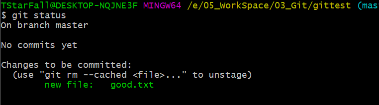

## 2、Git命令行操作

### 2.1 本地库操作

#### 2.1.1本地库初始化

在指定目录下（项目目录）执行`git init`命令，对本地仓库进行初始化，如下图小的红色框中所示，初始化了一个空的`Git`仓库在`E:/05_WorkSpace/03_Git/gittest/.git/`这个目录下

使用`ls -la`或者`ls -lA`查看`.`开头的隐藏目录和文件

命令：`git add`（`git init`?）

效果：

注意：.git目录中存放的是本地库相关的子目录和文件，不要删除，也不要随意改动，否则本地库将不能正常工作

#### 2.1.2 设置签名

1、形式：

用户名：tang

Email地址：goodMorning@atguigu.com

2、作用：区分不同的开发人员的身份

3、辨析：这里设置的签名和登录远程库（代码托管中心）的账号、密码没有任何关系，仅仅是用于区分开发人员的身份

4、命令：

项目级别/仓库级别：仅在当前项目（仓库）的范围内有效

`git config user.name tom_pro`

`git config user.email goodMorning_pro@atguigu.com`

信息保存位置：`./.git/config`文件

查看签名：在当前仓库使用`cat .git/config`查看签名

系统用户级别：登录当前操作系统用户范围（一般情况下设置系统用户级别的签名就够了，有特殊需求的可以设置项目级别的签名）

`git config --global user.name tom_glb`

`git config --global user.email goodMorning_glb@atguigu.com`

信息保存位置：`~/.gitconfig`文件

使用`cat ~/.gitconfig`命令查看系统用户级别的签名

优先级：就近原则，项目级别优先于与系统用户级别，二者都有时，采用项目级别的签名

如果只有系统用户级别的签名，就以系统用户级别的签名为准

二者不能都没有

#### 2.1.3基本操作

##### 查看状态

**命令**：`git status`

**作用**：查看工作区，暂存区状态

`on branch master`：在master(主干)分支上

`No commits yet`：还未有任何提交(仓库内没有提交数据)

`Nothing to commit`：没有可提交(暂存区没有东西可以提交)

使用vim创建文件后再查看，暂存区出现还未提交的文件

##### 添加操作

**命令**：`git add <file name>`

**作用**：将工作区“新建/修改”的文件添加到暂存区

执行`git add <file>`命令

再用`git status`查看，显示已经添加到暂存区，可以使用`git rm --cached <file>`清除缓存区中指定的文件

使用`git rm --cached <file>`清除暂存区指定文件，再查看状态，又恢复到原来的状态

##### 提交操作

 **命令**：`git commit -m "commit message" <file name>`

**作用**：将暂存区的内容提交到本地库

再次执行`git add <file>`命令后，执行`git commit <file>`命令

Vim中使用`set nu`显示行号

执行完毕

查看状态

修改原来的文件，后查看状态

`git add <file>`：更新提交的文件

`git restore <file> `：撤销更改

` "git add" and/or "git commit -a"`：提交到暂存区或者直接提交

使用`git add`提交到暂存区，使用`git restore --staged <file>`撤销暂存区提交

执行`git commit -m "这里是提交的信息" <file>`，执行这条命令不用进入vim编辑提交信息

##### 查看历史记录

**命令**：`git log`

**信息**：`HEAD -> master`当前版本，`HEAD`是一个指针，指向当前版本

`Author`设置的签名

`Date`提交的日期

多屏显示时，控制方式：

空格向下反页

b 向上反页

q 退出

**日志显示**：`git log --pretty=oneline`以漂亮的格式显示，在一行上显示日志信息

`git log --oneline`在一行上显示日志，哈希值只显示部分

`git reflog`可以查看回退到某一个版本需要多少步

HEAD@{需要回退到当前版本的步数}

##### 版本前进后退

**本质**

**基于索引值操作**：

命令：`git reset --hard [HEAD指针前面的哈希值]`，可以前进后退

查看日志

**使用`^`符号**：只能后退

命令：`git reset --hard HEAD^`，`^`符号代表回退多少个版本，一个`^`表示回退一个版本，n个`^`表示回退n个版本

**使用`~`符号**：只能后退

命令：`git reset --hard HEAD~n`，n表示需要回退多少个版本

##### reset的三个参数的对比

使用`git help reset`查看`reset`的参数

`--soft`参数：仅在本地库移动`HEAD`指针

`--mixed`参数：在本地库移动`HEAD`指针，并且重置暂存区

`--hard`参数：在本地库移动`HEAD`指针，并且重置暂存区和工作区

`git reset --hard HEAD`，重置

##### 永久删除文件和找回

**前提**：删除前，文件存在时的状态提交到本地库

**操作**：`git reset --hard [指针位置]`

删除操作已经提交到本地库：指针位置指向历史记录

删除操作尚未提交到本地库：指针位置使用`HEAD`

**删除**：

文件虽然删除，但是提交和删除的记录不可删除，除非将本地库删除，否则是记录是不可磨灭的

删除命令：`rm <file name>`

**找回**：

命令：`git reset --hard [索引值]`

##### 添加到暂存区的删除文件的找回

##### 比较文件的差异

**`git diff [文件名]`**：将工作区中的文件和暂存区进行比较

**`git diff [本地库中历史版本] [文件名]`**：将工作区的文件和本地库历史记录比较

**不带文件名比较多个文件**

#### 2.1.3 分支管理

##### 什么是分支

在版本控制过程中，使用多条线同事推进多个任务

##### 分支的好处

1、同时并行推进多个功能开发，提高开发效率

2、各个分支在开发过程中，如果某一个分支开发失败，不会对其它分支有任何影响，失败的分支删除重新开始即可

##### 分支操作

**创建分支**：`git branch [分支名]`

**查看分支**：`git branch -v`

**切换分支**：`git checkout [分支名]`

**合并分支**

1、切换到接受修改的分支（被合并，增加新内容）上

`git checkout [被合并分支]`

2、执行`merge`命令

`git merge [有新内容分支名]`

##### 解决冲突

**冲突的表现**

在文件内的冲突样式

**冲突的解决**

第一步、编辑文件，删除特殊符号

第二步、把文件修改到满意程度，保存退出

第三步、`git add [文件名]`

第四步、`git commit -m "日志信息"`

此时`commit`后不嫩古代具体文件名

#### 2.2 远程库操作

